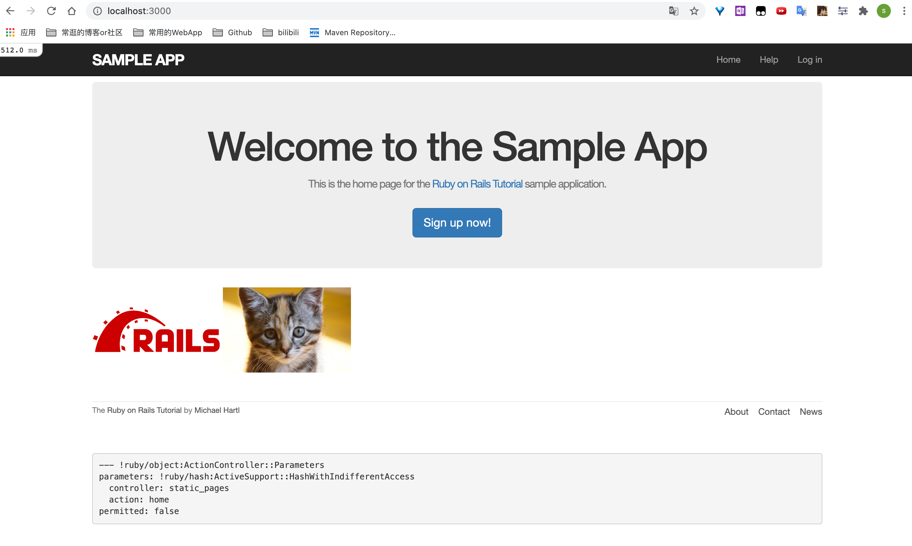
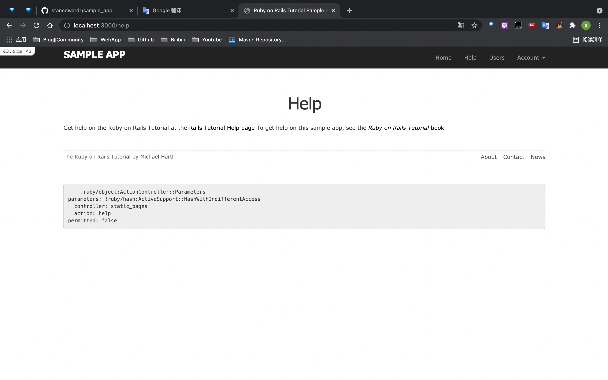

# Sample_app

## 项目背景

学习自《railstutorial6th》

一个简单的仿Twitter的网站

## 涉及到的技术点

Ruby on Rails

Bootstrap

## 使用说明

clone此项目

使用rvm或rbenv指定ruby版本，或者修改Gemfile文件中版本为系统自带的ruby版本

运行以下命令：

```shell
bundle
rails db:create
rails db:migrate
rails s
```

## 页面

**没有猫图的网页还算是网页嘛🐈**




